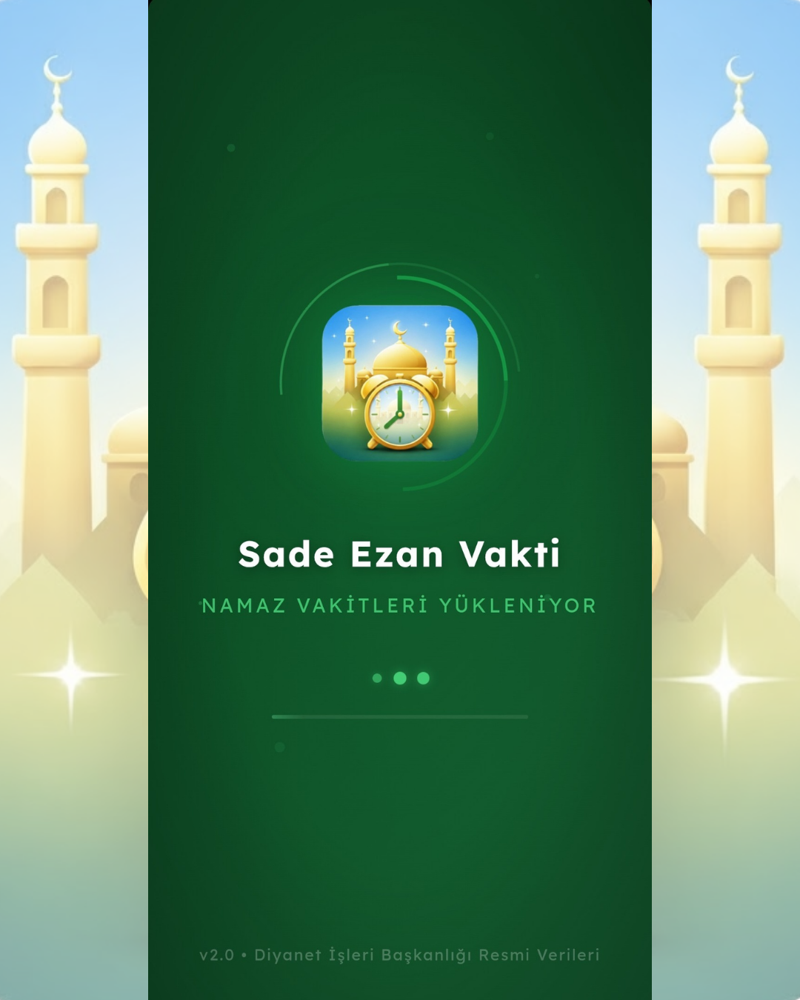
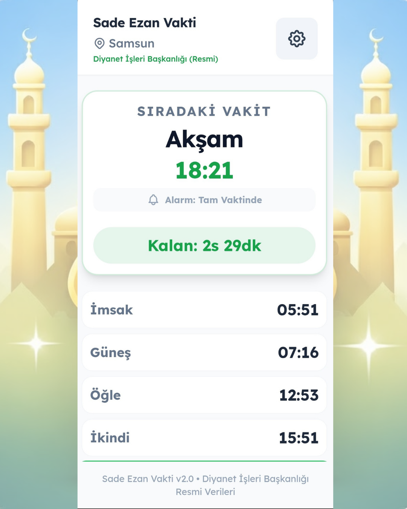
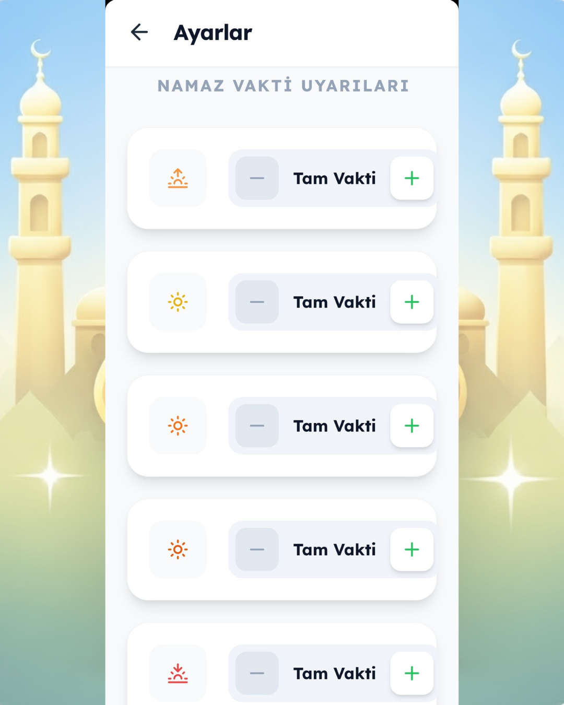
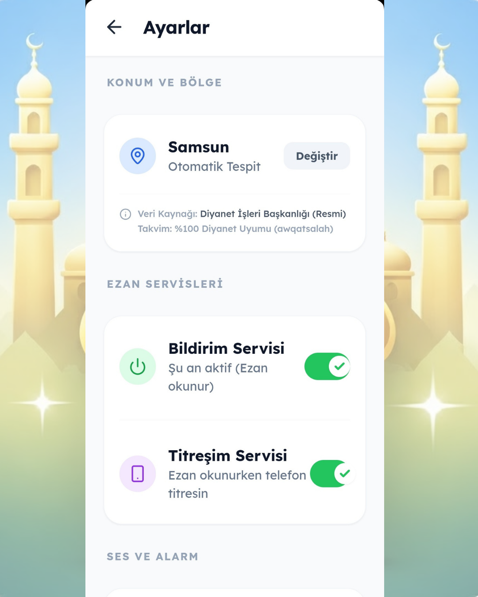

# Ezan Vakti

Modern ve sade ezan vakti deneyimi.

<p align="center">
  
</p>

<p align="center">
  <a href="https://react.dev"></a>
  <a href="https://www.typescriptlang.org"></a>
  <a href="https://vitejs.dev"></a>
  <a href="https://capacitorjs.com"></a>
  
</p>

---

## ⚠️ Önemli Not

Bu repository portföy ve vitrin amaçlı hazırlanmıştır.

Kod yapısı, uygulama ekran görüntüleri ve proje mimarisi sergilenmektedir. Bazı özel yapılandırmalar, servis bağımlılıkları veya üretim dosyaları repository içerisinde bulunmayabilir.

---

## 📱 Uygulama Ekran Görüntüleri

<div align="center">
  <table>
    <tr>
      <td align="center" width="25%">
        
        <br />
        <sub><b>Ana Ekran</b></sub>
      </td>
      <td align="center" width="25%">
        
        <br />
        <sub><b>Vakitler Tablosu</b></sub>
      </td>
      <td align="center" width="25%">
        
        <br />
        <sub><b>Ayarlar</b></sub>
      </td>
      <td align="center" width="25%">
        
        <br />
        <sub><b>Kıble Yönü</b></sub>
      </td>
    </tr>
    <tr>
      <td align="center" width="25%">
        
        <br />
        <sub><b>Alarm Bildirimi</b></sub>
      </td>
      <td align="center" width="25%">
        
        <br />
        <sub><b>Başlangıç Ekranı</b></sub>
      </td>
      <td colspan="2"></td>
    </tr>
  </table>
</div>

---

## 🎯 Proje Hakkında

Ezan Vakti, Diyanet İşleri Başkanlığı'nın resmi verileriyle çalışan modern bir mobil namaz vakti uygulaması örneğidir.

Uygulama; alarm yönetimi, konum tabanlı vakit hesaplama, kıble yönü desteği ve sade kullanıcı deneyimi odak alınarak geliştirilmiştir.

---

## ✨ Temel Özellikler

<table>
<tr>
<td width="50%" valign="top">

### ⏰ Vakit & Alarm Sistemi
- Tam vakit alarm desteği
- Otomatik vakit güncelleme sistemi
- Ayarlanabilir bildirim süreleri
- Resmi Diyanet verisi uyumu
- Yerel ses ve titreşim desteği
- Offline vakit önbellekleme

</td>
<td width="50%" valign="top">

### 📱 Kullanıcı Deneyimi
- Minimal ve yüksek kontrast arayüz
- Kolay erişilebilir ayarlar paneli
- Kıble yönü ekranı
- Konum destekli şehir algılama
- Sesli ezan veya kısa bildirim modu
- Mobil odaklı sade tasarım sistemi

</td>
</tr>
</table>

---

## 🏗️ Teknik Mimari

- React tabanlı SPA mimarisi
- TypeScript ile tip güvenli yapı
- Capacitor native bridge entegrasyonu
- Local notification scheduling sistemi
- Geolocation API kullanımı
- Compass sensor tabanlı kıble yönü hesaplama
- React Hooks tabanlı state yönetimi
- Mobil performans odaklı component yapısı

---

## 🛠️ Teknoloji Stack

### Frontend
- React
- TypeScript
- Vite
- Capacitor

### Mobil Özellikler
- React Hooks
- CSS
- Notification API
- Native alarm desteği
- Geolocation API
- Device sensor entegrasyonu

---

## 📦 Kurulum

```bash
git clone https://github.com/davutcan15081/Ezan-Vakti.git
cd Ezan-Vakti
npm install
npm run dev
```

> Not: Bu repository vitrin amaçlı hazırlandığından bazı özel servisler veya üretim yapılandırmaları eksik olabilir.

---

## 🎥 Demo

Yakında eklenecek:

- APK Demo
- Video Tanıtım
- GIF Önizleme

---

## 📁 Önerilen Repository Yapısı

```text
assets/
docs/
screenshots/
src/
LICENSE
.gitignore
README.md
README_TR.md
```

---

## 📄 Lisans

Bu proje portföy ve vitrin amaçlı paylaşılmıştır.

Kodların ticari kullanımı, yeniden dağıtımı veya birebir kopyalanması proje sahibinin iznine tabidir.

© 2024 Davut Can
